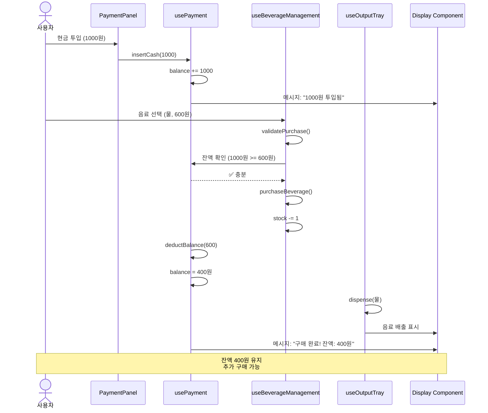
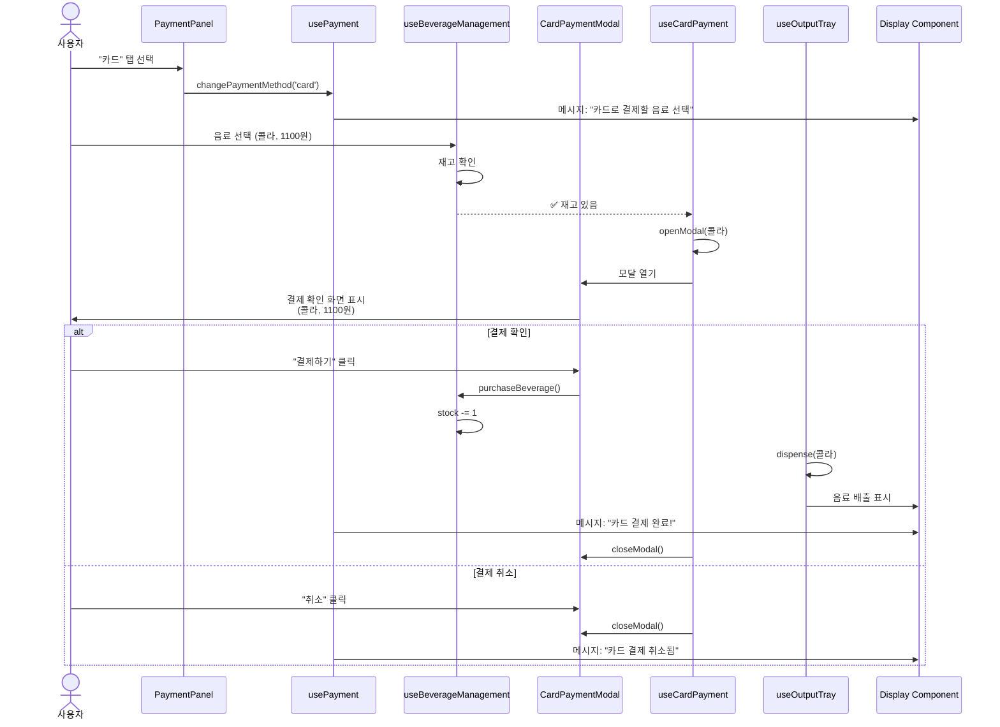
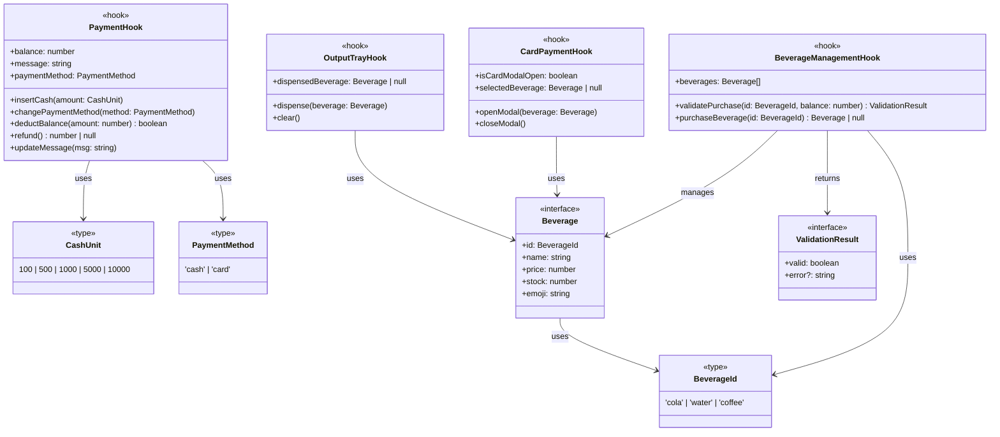

## 1. 현금 결제 시퀀스 다이어그램

```mermaid
sequenceDiagram
    actor User as 사용자
    participant UI as PaymentPanel
    participant Payment as usePayment
    participant BevMgmt as useBeverageManagement
    participant Output as useOutputTray
    participant Display as Display Component

    User->>UI: 현금 투입 (1000원)
    UI->>Payment: insertCash(1000)
    Payment->>Payment: balance += 1000
    Payment->>Display: 메시지: "1000원 투입됨"

    User->>BevMgmt: 음료 선택 (물, 600원)
    BevMgmt->>BevMgmt: validatePurchase()
    BevMgmt->>Payment: 잔액 확인 (1000원 >= 600원)
    Payment-->>BevMgmt: ✅ 충분

    BevMgmt->>BevMgmt: purchaseBeverage()
    BevMgmt->>BevMgmt: stock -= 1

    Payment->>Payment: deductBalance(600)
    Payment->>Payment: balance = 400원

    Output->>Output: dispense(물)
    Output->>Display: 음료 배출 표시

    Payment->>Display: 메시지: "구매 완료! 잔액: 400원"

    Note over User,Display: 잔액 400원 유지<br/>추가 구매 가능
```

## 2. 카드 결제 시퀀스 다이어그램

```mermaid
sequenceDiagram
    actor User as 사용자
    participant UI as PaymentPanel
    participant Payment as usePayment
    participant BevMgmt as useBeverageManagement
    participant CardModal as CardPaymentModal
    participant CardHook as useCardPayment
    participant Output as useOutputTray
    participant Display as Display Component

    User->>UI: "카드" 탭 선택
    UI->>Payment: changePaymentMethod('card')
    Payment->>Display: 메시지: "카드로 결제할 음료 선택"

    User->>BevMgmt: 음료 선택 (콜라, 1100원)
    BevMgmt->>BevMgmt: 재고 확인
    BevMgmt-->>CardHook: ✅ 재고 있음

    CardHook->>CardHook: openModal(콜라)
    CardHook->>CardModal: 모달 열기

    CardModal->>User: 결제 확인 화면 표시<br/>(콜라, 1100원)

    alt 결제 확인
        User->>CardModal: "결제하기" 클릭
        CardModal->>BevMgmt: purchaseBeverage()
        BevMgmt->>BevMgmt: stock -= 1

        Output->>Output: dispense(콜라)
        Output->>Display: 음료 배출 표시

        Payment->>Display: 메시지: "카드 결제 완료!"
        CardHook->>CardModal: closeModal()

    else 결제 취소
        User->>CardModal: "취소" 클릭
        CardHook->>CardModal: closeModal()
        Payment->>Display: 메시지: "카드 결제 취소됨"
    end
```

## 5. 타입 관계도

```mermaid
classDiagram
    class BeverageId {
        <<type>>
        'cola' | 'water' | 'coffee'
    }

    class CashUnit {
        <<type>>
        100 | 500 | 1000 | 5000 | 10000
    }

    class PaymentMethod {
        <<type>>
        'cash' | 'card'
    }

    class Beverage {
        <<interface>>
        +id: BeverageId
        +name: string
        +price: number
        +stock: number
        +emoji: string
    }

    class ValidationResult {
        <<interface>>
        +valid: boolean
        +error?: string
    }

    class PaymentHook {
        <<hook>>
        +balance: number
        +message: string
        +paymentMethod: PaymentMethod
        +insertCash(amount: CashUnit)
        +changePaymentMethod(method: PaymentMethod)
        +deductBalance(amount: number) boolean
        +refund() number | null
        +updateMessage(msg: string)
    }

    class BeverageManagementHook {
        <<hook>>
        +beverages: Beverage[]
        +validatePurchase(id: BeverageId, balance: number) ValidationResult
        +purchaseBeverage(id: BeverageId) Beverage | null
    }

    class OutputTrayHook {
        <<hook>>
        +dispensedBeverage: Beverage | null
        +dispense(beverage: Beverage)
        +clear()
    }

    class CardPaymentHook {
        <<hook>>
        +isCardModalOpen: boolean
        +selectedBeverage: Beverage | null
        +openModal(beverage: Beverage)
        +closeModal()
    }

    Beverage --> BeverageId : uses
    PaymentHook --> CashUnit : uses
    PaymentHook --> PaymentMethod : uses
    BeverageManagementHook --> Beverage : manages
    BeverageManagementHook --> ValidationResult : returns
    BeverageManagementHook --> BeverageId : uses
    OutputTrayHook --> Beverage : uses
    CardPaymentHook --> Beverage : uses
```
