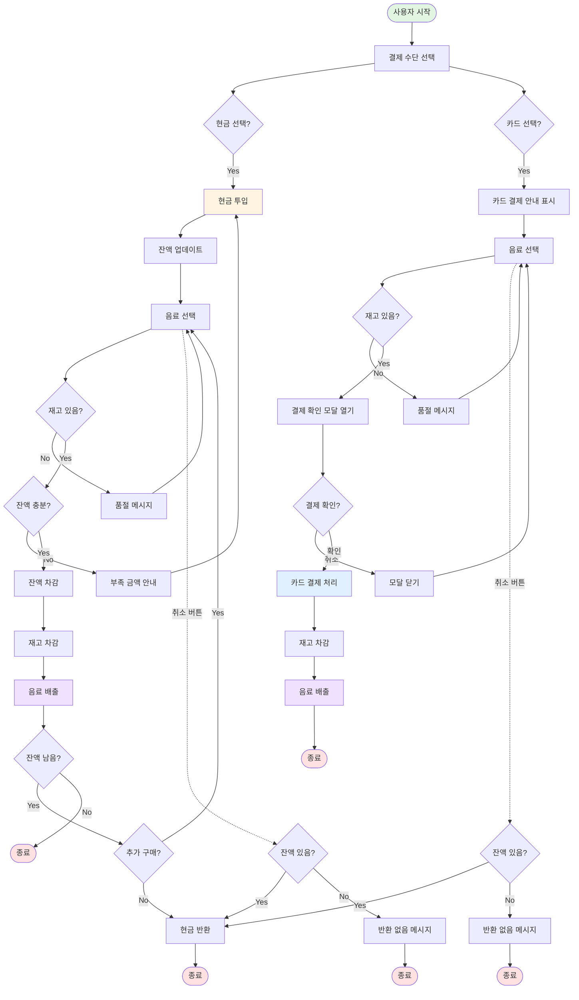
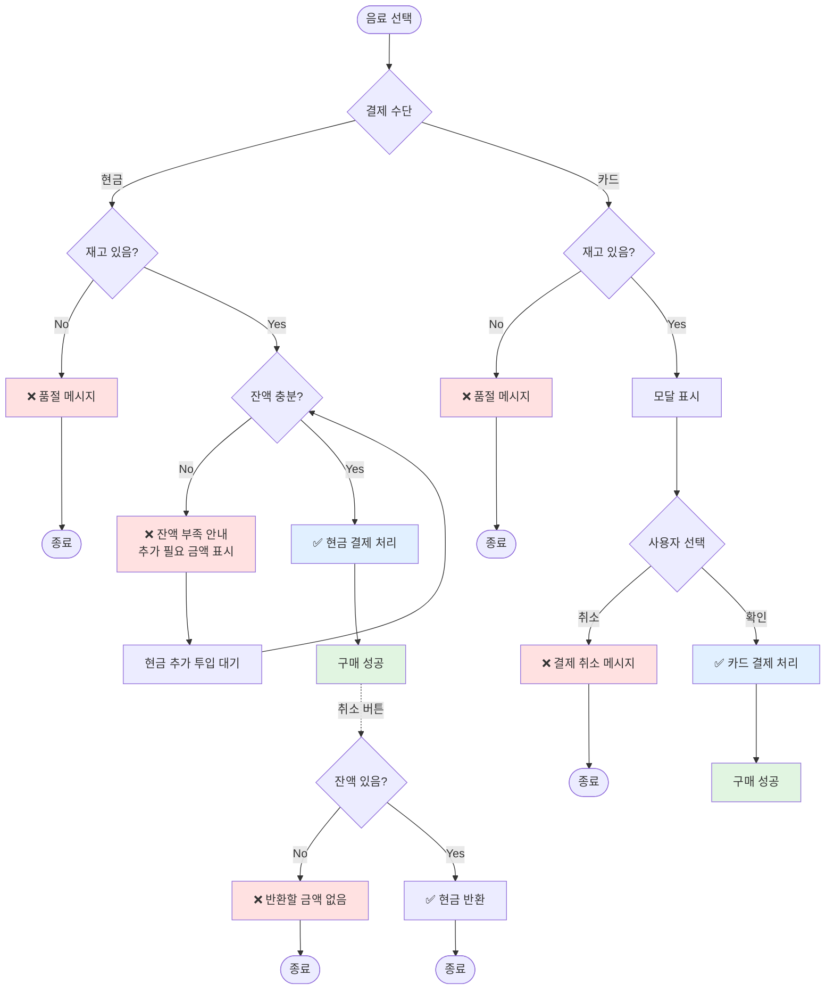

## 1. 전체 시스템 플로우차트

```mermaid
flowchart TD
    Start([사용자 시작]) --> SelectPayment[결제 수단 선택]

    SelectPayment --> CashMode{현금 선택?}
    SelectPayment --> CardMode{카드 선택?}

    %% 현금 결제 플로우
    CashMode -->|Yes| InsertCash[현금 투입]
    InsertCash --> UpdateBalance[잔액 업데이트]
    UpdateBalance --> SelectBeverage1[음료 선택]

    SelectBeverage1 --> CheckStock1{재고 있음?}
    CheckStock1 -->|No| OutOfStock1[품절 메시지]
    OutOfStock1 --> SelectBeverage1

    CheckStock1 -->|Yes| CheckBalance{잔액 충분?}
    CheckBalance -->|No| InsufficientBalance[부족 금액 안내]
    InsufficientBalance --> InsertCash

    CheckBalance -->|Yes| DeductBalance[잔액 차감]
    DeductBalance --> DeductStock1[재고 차감]
    DeductStock1 --> DispenseBeverage1[음료 배출]
    DispenseBeverage1 --> RemainingBalance{잔액 남음?}

    RemainingBalance -->|Yes| ContinuePurchase{추가 구매?}
    ContinuePurchase -->|Yes| SelectBeverage1
    ContinuePurchase -->|No| RefundCash[현금 반환]

    RemainingBalance -->|No| End1([종료])
    RefundCash --> End2([종료])

    %% 카드 결제 플로우
    CardMode -->|Yes| ShowCardMessage[카드 결제 안내 표시]
    ShowCardMessage --> SelectBeverage2[음료 선택]

    SelectBeverage2 --> CheckStock2{재고 있음?}
    CheckStock2 -->|No| OutOfStock2[품절 메시지]
    OutOfStock2 --> SelectBeverage2

    CheckStock2 -->|Yes| OpenModal[결제 확인 모달 열기]
    OpenModal --> UserConfirm{결제 확인?}

    UserConfirm -->|취소| CloseModal[모달 닫기]
    CloseModal --> SelectBeverage2

    UserConfirm -->|확인| ProcessPayment[카드 결제 처리]
    ProcessPayment --> DeductStock2[재고 차감]
    DeductStock2 --> DispenseBeverage2[음료 배출]
    DispenseBeverage2 --> End3([종료])

    %% 취소/반환
    SelectBeverage1 -.->|취소 버튼| CancelCheck1{잔액 있음?}
    SelectBeverage2 -.->|취소 버튼| CancelCheck2{잔액 있음?}

    CancelCheck1 -->|Yes| RefundCash
    CancelCheck1 -->|No| NoRefund1[반환 없음 메시지]
    NoRefund1 --> End4([종료])

    CancelCheck2 -->|Yes| RefundCash
    CancelCheck2 -->|No| NoRefund2[반환 없음 메시지]
    NoRefund2 --> End5([종료])

    style Start fill:#e1f5e1
    style End1 fill:#ffe1e1
    style End2 fill:#ffe1e1
    style End3 fill:#ffe1e1
    style End4 fill:#ffe1e1
    style End5 fill:#ffe1e1
    style InsertCash fill:#fff4e1
    style ProcessPayment fill:#e1f0ff
    style DispenseBeverage1 fill:#f0e1ff
    style DispenseBeverage2 fill:#f0e1ff
```

## 2. 예외 처리 플로우

```mermaid
flowchart TD
    Start([음료 선택]) --> CheckPaymentMethod{결제 수단}

    %% 현금 결제 예외
    CheckPaymentMethod -->|현금| CheckStock1{재고 있음?}
    CheckStock1 -->|No| Error1[❌ 품절 메시지]
    Error1 --> End1([종료])

    CheckStock1 -->|Yes| CheckBalance{잔액 충분?}
    CheckBalance -->|No| Error2[❌ 잔액 부족 안내<br/>추가 필요 금액 표시]
    Error2 --> WaitCash[현금 추가 투입 대기]
    WaitCash --> CheckBalance

    CheckBalance -->|Yes| ProcessCash[✅ 현금 결제 처리]
    ProcessCash --> Success1[구매 성공]

    %% 카드 결제 예외
    CheckPaymentMethod -->|카드| CheckStock2{재고 있음?}
    CheckStock2 -->|No| Error3[❌ 품절 메시지]
    Error3 --> End2([종료])

    CheckStock2 -->|Yes| ShowModal[모달 표시]
    ShowModal --> UserDecision{사용자 선택}

    UserDecision -->|취소| Error4[❌ 결제 취소 메시지]
    Error4 --> End3([종료])

    UserDecision -->|확인| ProcessCard[✅ 카드 결제 처리]
    ProcessCard --> Success2[구매 성공]

    %% 반환 예외
    Success1 -.->|취소 버튼| RefundCheck{잔액 있음?}
    RefundCheck -->|No| Error5[❌ 반환할 금액 없음]
    Error5 --> End4([종료])

    RefundCheck -->|Yes| Refund[✅ 현금 반환]
    Refund --> End5([종료])

    style Error1 fill:#ffe1e1
    style Error2 fill:#ffe1e1
    style Error3 fill:#ffe1e1
    style Error4 fill:#ffe1e1
    style Error5 fill:#ffe1e1
    style Success1 fill:#e1f5e1
    style Success2 fill:#e1f5e1
    style ProcessCash fill:#e1f0ff
    style ProcessCard fill:#e1f0ff
```
